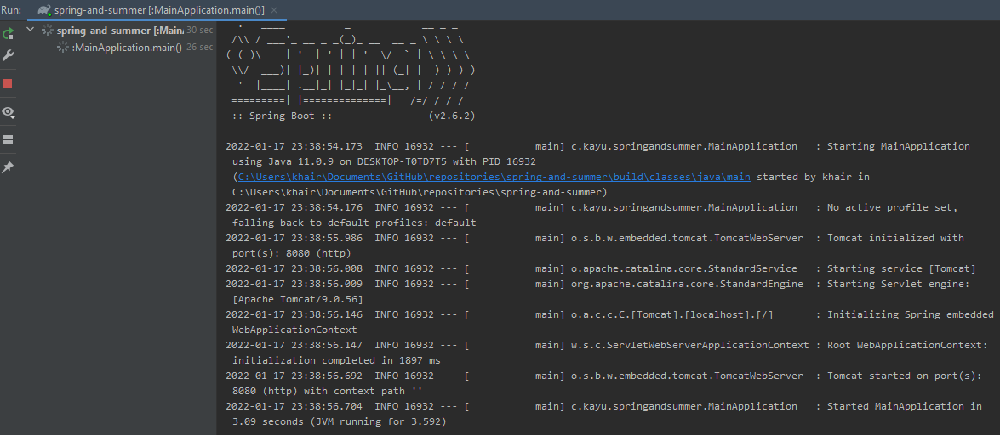
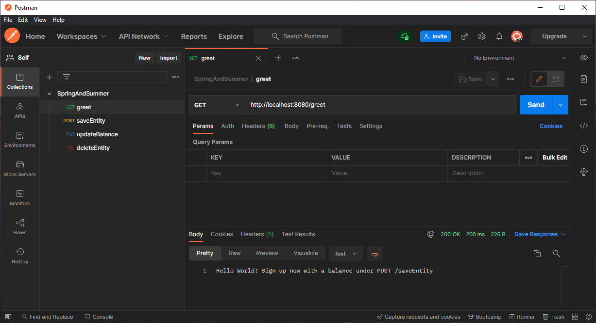
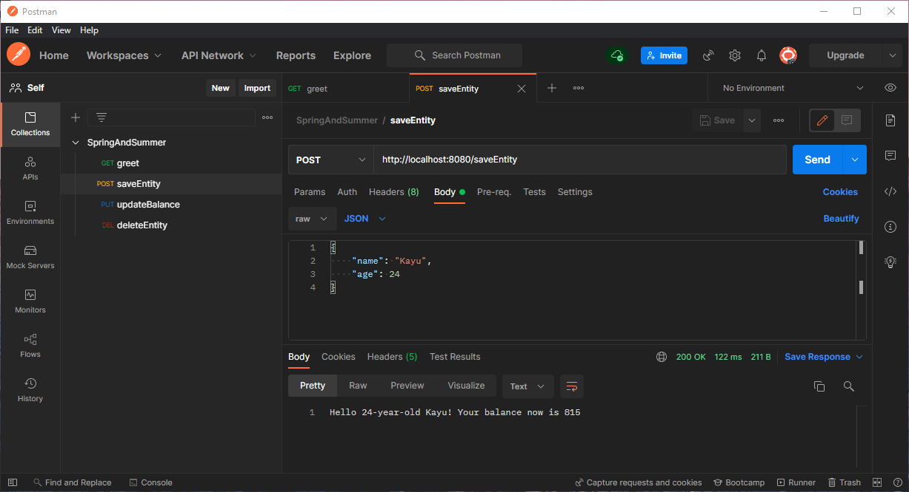
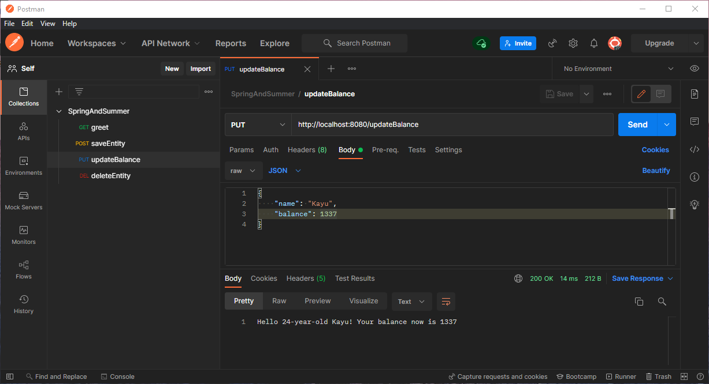
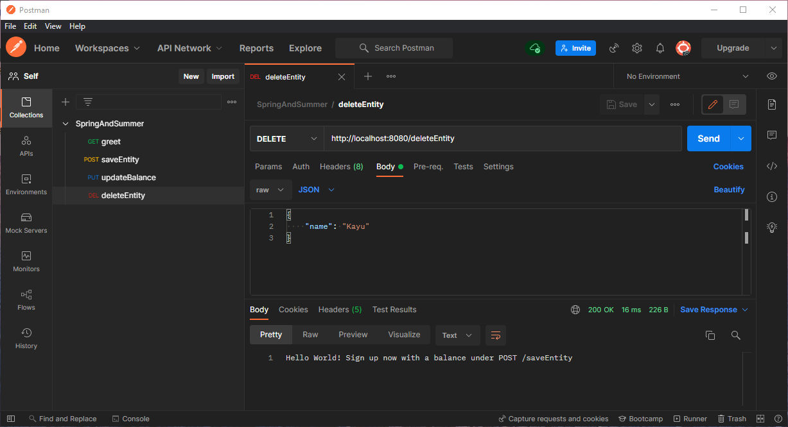
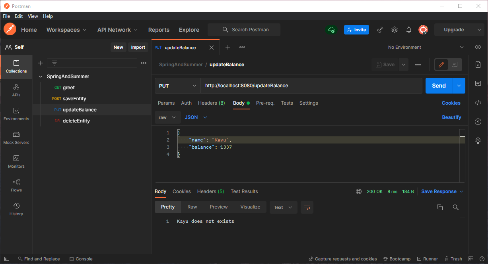

# Welcome to spring-and-summer!

This is just a test SpringBoot application I created for experimentation. Displays Jackson mapping, SpringBoot Web and basic CRUD actions using RESTful APIs. 

### Comments

There is no database needed to run, but it also means that data stored in the application will be wiped after use (consider simple file storage, or just jump to using database management with H2 and Spring Data dependencies). Adding a logging system and having unit testing are TODO actions currently.

# Setup guide

* Ensure Java 11 is installed.
* Best opened with IntelliJ.
* Select the `build.gradle` when opening to load the project as well as its configuration.
* Also install and setup PostMan for API manual testing.

# Running the application

* Run the `MainApplication.java`.
* Open up PostMan and run the various endpoints available (see [here](#endpoints))
  * Default setup will be `http://localhost:8080/...`
* See screenshots for some sample outputs.
* You can also run the application with a debugger to see the workings of the service classes.

# Endpoints

There are 4 notable endpoints present in this application.

## `GET /greet?name=NAME`

Returns a greeting String with `NAME` (default is `World`). If `NAME` exists in the application system, then it returns a more descriptive message.

## `POST /saveEntity`

Saves an Entity into the application. Entities are unique by NAME, hence if a new Entity with the same name is to be created, the application will reject it.

Format of JSON body:
``` json
{
    "name": String name,
    "age": INT age
}
```

## `PUT /updateBalance`

Updates an Entity if it exists in the application currently. Only the balance of an Entity can be modified.

Format of JSON body:
``` json
{
    "name": String name,
    "balance": INT newBalance
}
```

## `DELETE /deleteEntity`

Deletes an Entity if it exists in the application currently.

Format of JSON body:
``` json
{
    "name": String name
}
```

# Screenshots of usage

### Running on IntelliJ



### Greeting message



### Saving a new Entity



### Updating the balance of an Entity



### Deleting an Entity



### Updating a non-existent Entity


